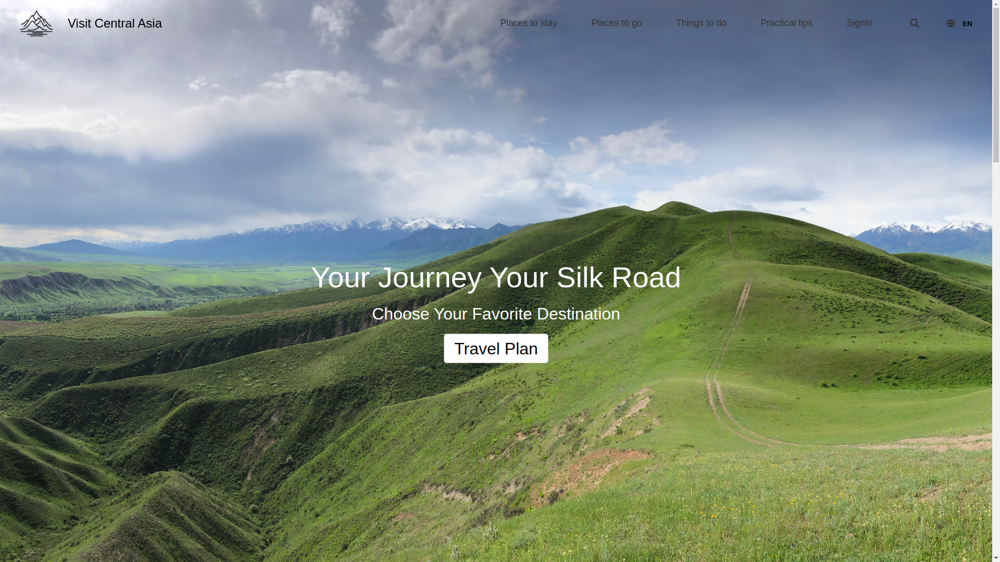
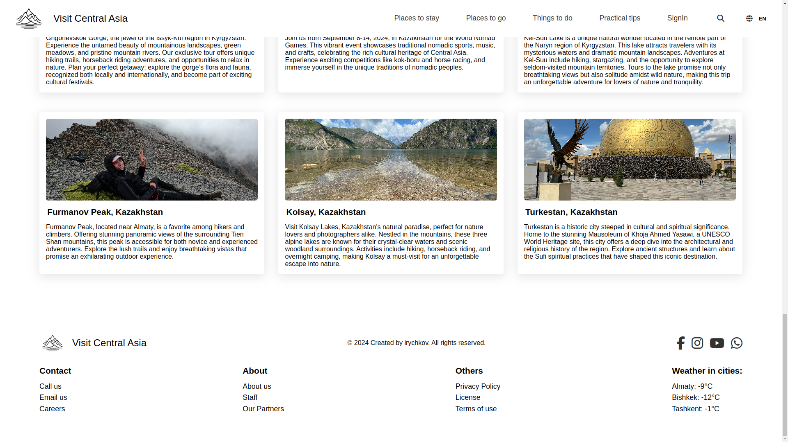

# React Central Asia Explorer → E-commerce Transformation

**Status:** In Progress 🚧

## Tech Stack 🛠️

- **Frontend:** React.js + MUI (Material-UI) for a modern and responsive UI
- **State Management:** TBD (likely Context API or Redux)
- **Backend:** Node.js + Express.js
- **Database:** MongoDB for product, user, and order management
- **Payments:** Stripe integration for secure transactions
- **Authentication**

## Screenshots

---

---

---

---

---

---

---

## Current & Planned Features

### Current Features on progress
- ✅ **Support 4 languages** FI, EN, IT, RU
- ✅ **Product Listings:** Display and filter items (e.g., upcomming tours, bookings)
- ✅ **Cart & Checkout:** Add to cart, manage orders, and process payments via Stripe
- ✅ **Admin Panel:** Manage products, orders, and users
- ✅ **User Authentication:** Login/signup system for personalized experiences
- ✅ **Optimized UI/UX:** Smooth navigation and mobile-friendly design

### Future Goals
- Implement recommendation system for personalized shopping
- Add SEO optimizations for better visibility

## Project Description

This project is a learning experience, evolving as I experiment with React, API integrations, and e-commerce features. Feel free to follow along, suggest ideas, or contribute!

